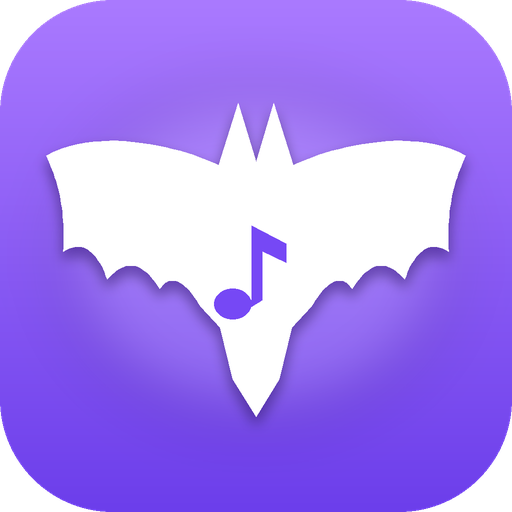

<div align="center">



# Batlay

**Affichez la musique que vous écoutez dans OBS, avec un overlay que vous dessinez vous-même.**

[](https://github.com/BatStream-off/Batlay/releases/latest)
[](https://github.com/BatStream-off/Batlay/releases)


[**⬇ Télécharger Batlay**](https://github.com/BatStream-off/Batlay/releases/latest)

</div>

<!--
  Captures d'écran : ajoutez vos images dans docs/screenshots/ puis décommentez.

<p align="center">
  
  
</p>
-->

---

## Ce que fait Batlay

Batlay détecte le morceau en cours (titre, artiste, pochette, progression) et l'envoie vers une page d'overlay transparente que vous ajoutez dans OBS comme source « Navigateur ». Un éditeur visuel vous laisse tout personnaliser : position, taille, polices, couleurs, dégradés, bordures, ombres.

## Fonctionnalités

- **Trois sources musicales** : lecture système Windows (Spotify gratuit, YouTube Music, VLC…), Spotify (compte Premium) et un mode démo pour tester sans rien connecter.
- **Éditeur d'overlay complet** : glisser-déposer, poignées de redimensionnement, magnétisme avec guides, calques (réordonner, masquer, verrouiller), annuler / rétablir, raccourcis clavier.
- **Composants** : pochette, titre, artiste(s), album, barre de progression, temps écoulé / restant, durée, source, texte libre, formes et fonds.
- **Presets prêts à l'emploi** : Minimal, Modern, Glass, Neon, Compact, Large, ou canvas vide.
- **Aperçu en temps réel**, identique à ce que reçoit OBS, avec fonds de scène simulés.
- **Modifications en direct** : « Enregistrer » met à jour OBS sans recharger la source.
- **Progression fluide** synchronisée sur l'horloge du lecteur, artistes multiples et accents gérés correctement.
- **Import / export** d'overlays en `.json`.
- **Thème sombre, clair ou système**, couleur d'accent personnalisable.
- **Mises à jour intégrées** depuis GitHub, en un clic.

## Installation

1. Ouvrez la [dernière version](https://github.com/BatStream-off/Batlay/releases/latest).
2. Téléchargez **`Batlay-Setup-x.y.z.exe`** et lancez-le.
3. Suivez l'installateur (dossier et raccourcis au choix).

> **Windows affiche « Windows a protégé votre ordinateur » ?**
> Batlay n'est pas signé numériquement. Cliquez sur **Informations complémentaires**, puis **Exécuter quand même**.

Prérequis : Windows 10 (1809 ou plus récent) ou Windows 11, et OBS Studio.

## Démarrage rapide

1. **Choisissez une source** dans *Connexions* : *Lecture système* pour le plus simple, ou *Mode démo* pour essayer.
2. **Créez un overlay** dans *Overlays* : partez d'un preset, puis ajustez-le dans l'éditeur.
3. **Ajoutez-le à OBS** :
   - dans Batlay, cliquez sur **Copier l'URL OBS** ;
   - dans OBS : **Sources → + → Navigateur**, collez l'URL ;
   - réglez la largeur et la hauteur sur la taille du canvas affichée dans l'éditeur.

Le fond de la page est transparent : seul ce que vous dessinez apparaît dans OBS. Le tableau de bord de Batlay vous guide sur ces trois étapes.

## Sources musicales

| Source | Compte requis | Notes |
|---|---|---|
| **Lecture système** | Aucun | Lit ce que Windows affiche dans son contrôle multimédia : Spotify (même gratuit), navigateur, VLC, etc. Si plusieurs lecteurs jouent, vous choisissez lequel suivre. |
| **Spotify** | Spotify **Premium** | Connexion via votre propre Client ID (voir ci-dessous). Lecture seule du morceau en cours. |
| **Mode démo** | Aucun | Six morceaux d'exemple pour tester overlays et animations. |

<details>
<summary><b>Connecter Spotify</b></summary>

Batlay n'embarque aucun identifiant Spotify : vous créez le vôtre (gratuit).

1. Créez une application sur le [Spotify Developer Dashboard](https://developer.spotify.com/dashboard).
2. Ajoutez cette **Redirect URI**, exactement :
   ```
   http://127.0.0.1:8945/callback
   ```
3. Dans *Settings → User Management*, ajoutez l'e-mail de votre compte Spotify (étape souvent oubliée).
4. Copiez le **Client ID** (le Client Secret n'est pas nécessaire).
5. Dans Batlay : **Connexions → Spotify**, collez le Client ID, puis **Connecter Spotify**.

Un compte Premium est exigé par Spotify pour les applications en mode développement. Sans Premium, utilisez la *Lecture système*.
</details>

## Mises à jour

Dans **Paramètres → Mises à jour**, cliquez sur **Rechercher une mise à jour**. Si une version plus récente existe sur GitHub, Batlay la télécharge puis propose **Installer et redémarrer**. Une pastille apparaît aussi dans la barre latérale. Rien n'est téléchargé sans votre accord.

## Confidentialité

- Tout reste sur votre PC : l'overlay est servi en local (par défaut sur `localhost:3000`, port modifiable dans *Paramètres*).
- Le jeton Spotify est chiffré avec le coffre Windows (DPAPI) avant d'être enregistré.
- Batlay contacte Internet uniquement pour : Spotify (si connecté), la recherche de pochettes (iTunes, Deezer, ListenBrainz, MusicBrainz, Audius, sans clé d'API) et GitHub (mises à jour).

## Dépannage

**L'overlay est vide dans OBS.** Vérifiez que le serveur d'overlay est « en ligne » (voyant vert en bas de la barre latérale) et qu'un morceau joue. Si le voyant est rouge, le port est peut-être déjà pris : changez-le dans *Paramètres*.

**« Aucune version publiée trouvée » dans les mises à jour.** La version la plus récente de GitHub est peut-être encore en brouillon ou son fichier `latest.yml` manque.

**Spotify refuse la connexion.** Vérifiez la Redirect URI, l'ajout de votre e-mail dans *User Management* et que le compte est Premium. Sinon, passez par la *Lecture système*.

**Les artistes en featuring sont incomplets.** Windows ne transmet que le texte fourni par le lecteur ; Batlay l'affiche tel quel.

## Pour les développeurs

Prérequis : [Node.js](https://nodejs.org) 20 ou plus récent.

```bash
git clone https://github.com/BatStream-off/Batlay.git
cd Batlay
npm install
npm run dev      # Vite + Electron
npm test         # tests unitaires (Vitest)
npm run dist     # installateur Windows dans release/
```

Le projet utilise Electron, React, TypeScript, Vite, Tailwind CSS et Zustand. L'architecture, le flux de données et les détails techniques sont dans [`docs/DEVELOPPEMENT.md`](docs/DEVELOPPEMENT.md). L'historique des changements est dans le [`CHANGELOG`](CHANGELOG.md).

<details>
<summary><b>Publier une nouvelle version</b></summary>

1. Augmentez la version : `npm version 0.3.1 --no-git-tag-version`, puis mettez à jour « Version x.y.z » dans `src/pages/Settings.tsx`.
2. Commit et push.
3. `git tag v0.3.1 && git push --tags` : le workflow `.github/workflows/release.yml` construit l'installateur et le publie avec `latest.yml`.

Sans GitHub Actions : `npm run dist`, puis créez la release à la main en y joignant `Batlay-Setup-x.y.z.exe`, son `.blockmap` et `latest.yml`.
</details>

## Auteur

Créé par **Adilbl** — [BatStream-off](https://github.com/BatStream-off).
